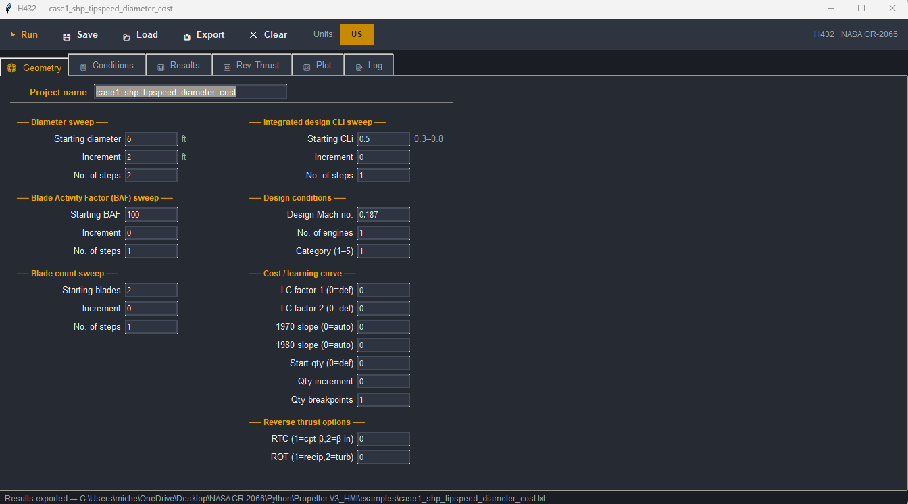

# GitHub — Personal Procedure Guide

Step-by-step reference for publishing a local git project on GitHub,
keeping it up to date, and adding screenshots to the README.

---

## 1. Prepare the local repository

### 1a. Create a `.gitignore`

Prevents generated files from being tracked.  Create `.gitignore` in the
project root with at least:

```
# Python
__pycache__/
*.py[cod]
*.pyo

# Virtual environment
.venv/
venv/

# Editor
.vscode/
launch.json

# OS
.DS_Store
Thumbs.db

# Runtime outputs (not source)
*.csv
*.json
*.txt
```

### 1b. Remove already-tracked files that should be ignored

If `__pycache__` or other ignored files were committed previously, remove
them from git's index (does NOT delete the files from disk):

```bash
git rm -r --cached __pycache__/
git rm --cached launch.json
```

### 1c. Create a `README.md`

Place it in the project root.  GitHub displays it automatically as the
repository front page.  Minimum useful content:

- Project title and one-line description
- Screenshot (added later — see section 3)
- Requirements and install instructions
- Quick start / usage example
- Project structure overview
- Background / references

### 1d. Commit everything

```bash
git add .gitignore README.md <all other source files>
git add -u          # also stage deletions of previously tracked files
git commit -m "Prepare for GitHub publication"
```

---

## 2. Publish to GitHub

### Step A — Create an empty repository on GitHub.com

1. Go to **github.com** and sign in.
2. Click **+** (top right) → **New repository**.
3. Fill in:
   - **Repository name** — e.g. `NASA-CR-2066-Propeller`
   - **Description** — one line summary
   - **Visibility** — Public or Private
   - **Do NOT** tick "Add a README", "Add .gitignore", or "Choose a license"
     (the repository must be completely empty).
4. Click **Create repository**.
5. Copy the HTTPS URL shown on the next page, e.g.:
   `https://github.com/michel-pequignot/NASA-CR-2066-Propeller.git`

### Step B — Link the local repo to GitHub and push

```bash
git remote add origin https://github.com/michel-pequignot/NASA-CR-2066-Propeller.git
git push -u origin master
```

**Authentication:** GitHub no longer accepts your account password.
Use a **Personal Access Token** instead:

1. GitHub → top-right avatar → **Settings**
2. Left sidebar → **Developer settings** → **Personal access tokens**
   → **Tokens (classic)**
3. **Generate new token** → tick the **repo** scope → set an expiry
4. Copy the token — it is shown only once.
5. When `git push` asks for a password, paste the token.

After the first push, git remembers the remote.  Future pushes are just:

```bash
git push
```

---

## 3. Add screenshots to the README

### Step A — Take and save the screenshot

1. Run the program and set it up to show something interesting.
2. Press **Win + Shift + S** to open the Windows Snipping Tool.
3. Select the window area you want to capture.
4. Save the file into a `docs/` folder inside the project, e.g.:
   - `docs/Geometry.png`
   - `docs/Operating_conditions.png`
   - `docs/Results.png`

### Step B — Reference the image in `README.md`

Add a markdown image tag wherever you want the picture to appear:

```markdown

```

The path is relative to the repository root.  Use forward slashes even on
Windows.

### Step C — Commit and push

```bash
git add docs/Geometry.png docs/Operating_conditions.png README.md
git commit -m "Add HMI screenshots to README"
git push
```

GitHub renders the images inline on the repository front page automatically.

---

## 4. Day-to-day workflow (after first publication)

### Make changes, then commit and push

```bash
# 1. Stage only the files you changed
git add HMI.py MAIN.py

# 2. Commit with a meaningful message
git commit -m "Short description of what changed and why"

# 3. Push to GitHub
git push
```

### Check what has changed before committing

```bash
git status          # lists modified / new / deleted files
git diff            # shows exact line-by-line changes
git log --oneline   # recent commit history
```

### Undo a staged file (before committing)

```bash
git restore --staged HMI.py
```

### Undo uncommitted changes to a file (WARNING: irreversible)

```bash
git restore HMI.py
```

---

## 5. Pre-commit hook (automated test gate)

This project has a pre-commit hook installed at `.git/hooks/pre-commit`
that runs `pytest` before every commit.  If any test fails the commit is
**aborted** automatically.

To bypass it in an emergency (use sparingly):

```bash
git commit --no-verify -m "Emergency fix — tests broken"
```

To reinstall the hook after cloning on a new machine, copy
`.git/hooks/pre-commit` from another clone or recreate it:

```bash
# The hook is not pushed to GitHub (`.git/` is never published).
# After a fresh clone, re-create it manually or add a setup script.
```

---

## 6. Useful GitHub features to configure

After publishing, on the repository page:

- **Topics** (gear icon next to "About"): add keywords like `propeller`,
  `aerodynamics`, `nasa`, `python` to make the repo discoverable.
- **Pin the repo** on your GitHub profile so it appears on your front page.
- **Releases**: tag a stable version with
  ```bash
  git tag v1.0.0
  git push origin v1.0.0
  ```
  then create a Release on GitHub.com to attach a ZIP download.
