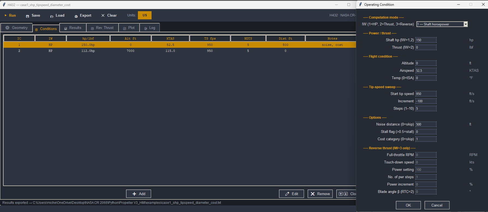

# NASA CR-2066 Propeller Design Tool — H432

A Python implementation of the **Hamilton Standard H432** propeller design
and performance program, originally published as NASA Contractor Report 2066
(1972).  The code covers all three computation modes of the original Fortran
IV program and adds a modern graphical interface.


---

## What it does

Given propeller geometry and one or more operating conditions, the program
computes:

| Quantity | Description |
|---|---|
| CP, CT | Power and thrust coefficients |
| SHP / BHP | Shaft / brake horsepower |
| Thrust (lbf / N) | Propulsive force |
| η (efficiency) | J · CT / CP |
| Blade angle | Pitch at 75 % radius (degrees) |
| Tip Mach | Tip speed and freestream Mach numbers |
| PNL | Perceived noise level (dB) at a given sideline distance |
| Weight | Propeller weight at 70 % and 80 % technology levels |
| Cost | Unit cost across a production quantity range |

### Computation modes

| IW | Mode | Input | Output |
|---|---|---|---|
| 1 | Fixed shaft power | BHP, tip-speed sweep | CT, thrust |
| 2 | Fixed thrust | Thrust, tip-speed sweep | CP, SHP |
| 3 | Reverse thrust | BHP, power %, speed sweep | Reverse thrust table |

IW=1 also supports a **50 % stall tip-speed iteration** (STALIT) that
automatically finds the maximum tip speed limited by blade stall.

---

## Features

- Full sweep over activity factor (AF), integrated design CL, blade count,
  diameter, and tip speed in a single run
- ISA atmosphere with optional hot/cold day offset (DT_ISA)
- User-specified temperature override
- Propeller characteristic map (CP–CT–J curves) for any geometry
- US / SI unit system toggle (internal computation always in US customary)
- Embedded matplotlib plots: η/CT/CP vs J, thrust/SHP/weight vs diameter,
  SHP vs tip speed, reverse thrust vs airspeed, characteristic maps
- Results export: plain text, CSV, JSON
- Project save/load (`.h432` files)

---

## Requirements

- Python 3.12 or newer
- [numpy](https://numpy.org/)
- [matplotlib](https://matplotlib.org/)
- [tkinter](https://docs.python.org/3/library/tkinter.html) (included with
  most Python distributions)

Install dependencies:

```bash
python -m pip install numpy matplotlib
```

---

## Quick start

### Graphical interface

```bash
python HMI.py
```

1. Fill in the **Geometry** tab (diameter, activity factor, blade count, …).
2. Add one or more operating conditions in the **Conditions** tab.
3. Click **▶ Run**.
4. Explore results in the **Results**, **Plot**, and **Map** tabs.
5. Save with **💾 Save** (project) or **📤 Export** (CSV/JSON/TXT).



### Command-line / scripting

```python
from operating_condition import OperatingCondition, PropellerGeometry
from output import ResultsCollector
import MAIN as M

geom = PropellerGeometry(
    D=6.0, DD=2.0, ND=2,          # 6 ft and 8 ft diameters
    AF=150.0, DAF=0.0, NAF=1,
    BLADN=4.0, DBLAD=0.0, NBL=1,
    CLII=0.5, DCLI=0.0, ZNCLI=1,
    ZMWT=0.262)

cond = OperatingCondition(
    IW=2, THRUST=370.0,
    ALT=7500.0, VKTAS=163.2,
    TS=850.0, DTS=-100.0, NDTS=4,
    T=32.33)

col = ResultsCollector()
M.set_collector(col)
M.call_input([cond], geom)
M.main_loop()
M.set_collector(None)

for r in col.summary.rows:
    print(f"D={r.dia_ft:.0f} ft  Vt={r.tipspd_fps:.0f} fps  "
          f"CP={r.cp:.6f}  CT={r.ct:.6f}  SHP={r.shp:.1f}")
```

---

## Running the tests

```bash
python -m pip install pytest   # first time only
python -m pytest
```

74 tests covering interpolation routines (UNINT, BIQUAD), subroutines
(PERFM, WAIT, COST), atmosphere model, and end-to-end integration for all
three IW modes.

A **pre-commit hook** runs the full test suite automatically before every
`git commit`.  It is already installed in `.git/hooks/pre-commit`.

---

## Project structure

```
├── HMI.py                  Graphical interface (tkinter + matplotlib)
├── MAIN.py                 Main computation loop (call_input / main_loop)
├── PERFM.py                Aerodynamic performance lookup
├── REVTHT.py               Reverse-thrust computation
├── WAIT.py                 Propeller weight estimation
├── COST.py                 Production cost estimation
├── ZNOISE.py               Perceived noise level (PNL)
├── BIQUAD.py               Bivariate slope-continuous interpolation
├── UNINT.py                Univariate slope-continuous interpolation
├── operating_condition.py  OperatingCondition / PropellerGeometry dataclasses
├── output.py               ResultsCollector and export helpers
├── constants.py            Physical and unit-conversion constants
├── units.py                US / SI conversion helpers
├── common.py               Shared state objects (CommonAFCOR, …)
├── tests/                  pytest test suite (74 tests)
├── examples/               Example scripts
└── pyproject.toml          Project metadata and pytest configuration
```

---

## Background

The original H432 program was developed by Hamilton Standard for NASA and
documented in:

> *Maiorana, A. (1972). Computer Program for Design and Analysis of
> Low-Tip-Speed Propellers.* NASA Contractor Report 2066.

This Python port preserves the numerical algorithms exactly (including the
slope-continuous interpolation scheme and the secant-method blade-angle
solver) while replacing the Fortran I/O and fixed-format output with a
modern HMI and structured data export.

---

## License

This project is a research/educational tool based on a publicly funded NASA
report.  The aerodynamic data tables embedded in `PERFM.py` are reproduced
from NASA CR-2066.  See [NASA's media usage guidelines](https://www.nasa.gov/nasa-brand-center/images-and-media/) for details.
